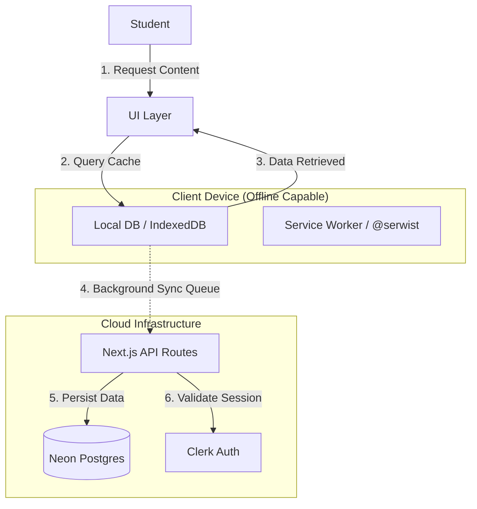

# S84-0126-Nebula-Nextjs-AWS-OfflineAcad

### Overview

OfflineAcademy is a lightweight, offline-first educational web application built for rural schools and regions with low or unreliable internet connectivity. It allows students to access learning content without an active internet connection and synchronizes updates only when connectivity is available.

Problem Statement

Most digital learning platforms assume:

Continuous internet access

High bandwidth

Modern devices

In rural and low-bandwidth areas, this leads to slow load times, broken content, high data usage, and disrupted learning experiences.

Our Solution & Approach

OfflineAcademy prioritizes offline usability and minimal bandwidth consumption.

Offline-first design ensures the app remains functional even without internet.

Lightweight content (text-based lessons and optimized images) reduces data usage.

PWA principles enable local caching, fast load times, and reliable offline access.

How OfflineAcademy Supports Low-Bandwidth Areas

Content is cached locally during initial access.

Lessons remain fully accessible offline.

Only updated data is synchronized when the internet is restored.

No video streaming or heavy assets are used.

Why OfflineAcademy Is Effective

Designed specifically for low-bandwidth environments

Works on low-end devices

Minimizes network dependency

Reliable, scalable, and easy to deploy

Ensures uninterrupted learning in rural schools

### Project Timeline
## Week 1 – Planning & Setup

Define problem, goals, and success criteria

Finalize tech stack & system architecture

Create initial folder structure and base project setup

## Week 2 – Core Development

Build backend APIs & database models

Implement frontend UI + state management

Integrate core features and connect backend with frontend

## Week 3 – Testing & Optimization

Write unit + integration tests

Optimize performance and remove bugs

Improve UX and add validation & error handling

## Week 4 – Deployment & Documentation

Deploy backend + frontend

Add README, diagrams, and code comments

Final QA, polish, and release

---
## System Overview

Unlike traditional web applications that rely on constant server communication, OfflineEdu treats the local client as the primary source of truth. The application downloads curriculum content for offline consumption and synchronizes learning progress with the cloud only when connectivity is restored. This approach eliminates latency as a bottleneck for the user experience.

## Architectural Decision Records (ADR)

The technology stack was chosen to prioritize **performance on constrained hardware** and **resiliency in low-bandwidth environments**.

### 1. Frontend Architecture (Offline Core)

| Component | Technology | Architectural Justification |
| :--- | :--- | :--- |
| **Framework** | **Next.js 15 (App Router)** | Utilizes React Server Components (RSC) to offload rendering logic to the server, significantly reducing the client-side JavaScript bundle size and improving Time-to-Interactive (TTI) on low-end devices. |
| **PWA Engine** | **@serwist/next** | Implements aggressive Service Worker strategies (Stale-While-Revalidate) to serve cached assets immediately, allowing the application to function autonomously without network access. |
| **Local Persistence** | **Dexie.js (IndexedDB)** | **Core Infrastructure.** Provides a strongly typed abstraction over IndexedDB, enabling the storage of gigabytes of rich media and lesson content directly within the browser sandbox. |
| **State Management** | **TanStack Query v5** | Configured with `networkMode: 'offlineFirst'`. This decouples UI state from network availability, serving data from the local cache instantly while queuing background synchronization. |
| **Interface Layer** | **TailwindCSS + ShadCN** | Zero-runtime CSS generation minimizes main-thread blocking, ensuring fluid animation and scrolling performance on older mobile hardware. |

### 2. Cloud Infrastructure (Serverless Backend)

| Component | Technology | Architectural Justification |
| :--- | :--- | :--- |
| **Database** | **Neon (Postgres)** | **Scalability.** The serverless architecture supports "Database Branching," enabling isolated development environments that mirror production schemas without risking data integrity. |
| **ORM** | **Prisma** | Enforces strict type safety across the stack. The auto-generated client ensures that frontend TypeScript definitions remain in lock-step with backend database schema changes. |
| **CI/CD & Hosting** | **AWS Amplify (Gen 2)** | A managed pipeline optimized for Next.js, handling global edge distribution and automating build deployments upon version control events. |
| **Identity** | **Clerk** | Managed authentication infrastructure capable of handling complex session states, specifically distinguishing between offline "guest" access and authenticated synchronization events. |

## Data Synchronization Strategy

We adhere to a **"Local-First, Cloud-Second"** protocol. User interactions are optimistic, updating the UI immediately via the local database. Synchronization occurs asynchronously in the background.



## Development Setup

Follow these steps to configure the local development environment.

### Prerequisites

*   **Node.js 20+ (LTS)**
*   **Git** (Configured with SSH)

### Installation Guide

**1. Clone the repository**
```bash
git clone git@github.com:kalviumcommunity/S84-0126-Nebula-Nextjs-AWS-OfflineAcad.git
cd S84-0126-Nebula-Nextjs-AWS-OfflineAcad
```

**2. Install dependencies**
```bash
npm install
```

**3. Environment Configuration**
```bash
cp .env.example .env.local
# Note: Obtain the Neon DB connection string from the project administrator.
```

**4. Initialize Database Clients**
```bash
npx prisma generate
npx prisma db push
```

**5. Start the Development Server**
```bash
npm run dev
```

## Engineering Standards & Contribution Protocols

We maintain strict production engineering standards to ensure code quality and maintainability. Pull requests that do not adhere to these guidelines will not be merged.

### 1. Branching Strategy
*   `feat/feature-name`: For new capabilities and modules.
*   `fix/bug-description`: For patches and bug repairs.
*   `chore/setup`: For configuration changes, dependency updates, or documentation.

### 2. Commit Message Standards
We utilize **Conventional Commits** to automate changelog generation.
*   **Acceptable:** `feat: implement offline storage wrapper`
*   **Unacceptable:** `added storage`

### 3. Pull Request Requirements
*   **Visual Proof:** Must include a screenshot or screen recording for any UI modifications.
*   **Validation:** Must explicitly list "How to Test" steps for the reviewer.
*   **Pipeline Health:** Must pass all CI checks, including Linting, Type Checking, and Build verification.

## Project Structure

```text
/app
  /api          # Server-side API Routes (Edge compatible)
  /components   # React Components (ShadCN UI system)
  /lib
    /db.ts      # Dexie.js configuration (Local Persistence)
    /sync.ts    # Synchronization logic (Local to Cloud)
  /sw.ts        # Service Worker Entry Point (@serwist configuration)
/prisma         # Database Schema and migrations
/public         # Static Assets & PWA Manifests
```

## 🛡️ Quality Assurance (QA)

We enforce a "Zero-Broken-Windows" policy using strict static analysis.

### 1. Strict TypeScript (`tsconfig.json`)
We enabled `strict: true` and `noImplicitAny` to eliminate an entire class of runtime errors (undefined is not a function). This forces the team to think about data structures *before* writing logic.

### 2. The Linter (`.eslintrc.json`)
* **Rule:** `no-console: warn` -> Prevents debugging logs from leaking into production.
* **Rule:** `plugin:prettier/recommended` -> Delegates all styling to Prettier, preventing "tab vs space" wars in code reviews.

### 3. Automation (Husky)
We use `husky` and `lint-staged` to run checks *only on changed files*.
* **Benefit:** Prevents bad commits. If the code doesn't pass the linter, it cannot be pushed. This guarantees that `main` is always buildable.

### 4. Reproducibility
To reproduce the QA environment on a fresh clone:

```bash
cd offline-academy
npm install          # Installs all dependencies including husky
npm run prepare      # Initializes Husky hooks (runs automatically via postinstall)
```

The `prepare` script in `package.json` ensures Husky hooks are installed automatically after `npm install`. The `core.hooksPath` is configured to point to `.husky/` at the repo root, which runs `lint-staged` from the `offline-academy` subdirectory.

## 🧩 Global State Management (Context API)

We utilize **React Context + Custom Hooks** to manage global application state without "prop-drilling."

### 1. AuthContext (`useAuth`)
* **Purpose:** Manages user session and authentication status.
* **Feature:** Persists user session to `localStorage`, ensuring the user stays logged in even after a page refresh—critical for our "Offline" reliability.

### 2. UIContext (`useUI`)
* **Purpose:** Controls the application theme (Dark/Light) and Layout state.
* **Feature:** Auto-detects the user's OS color scheme preference on first load.

### 📐 Architecture Diagram
```
Component -> useHook() -> Context -> Global State
```

## 🛡️ Input Validation (Zod)

We treat all external input as "untrusted" until verified. We use **Zod** to enforce strict schemas on our API endpoints.

### 1. Schema Definition (`src/lib/schemas.ts`)
We define schemas once and infer their TypeScript types. This ensures our Frontend Forms and Backend APIs are always in sync.

```typescript
export const loginSchema = z.object({
  email: z.string().email({ message: "Invalid email address" }),
  password: z.string().min(6, { message: "Password must be at least 6 characters" }),
});

export type LoginInput = z.infer<typeof loginSchema>;
```

### 2. Error Handling Strategy
* **Middleware:** We catch `ZodError` explicitly in our API routes.
* **Response Format:** We return a standardized 400 Bad Request with specific field errors, allowing the UI to highlight exactly which input failed.

### 3. Evidence
**Success Case:**
```json
{"success":true,"message":"Validation Passed","data":{"email":"student@kalvium.community"}}
```

**Failure Case:**
```json
{"success":false,"message":"Validation Error","errors":[{"field":"email","message":"Invalid email address"},{"field":"password","message":"Password must be at least 6 characters"}]}
```
